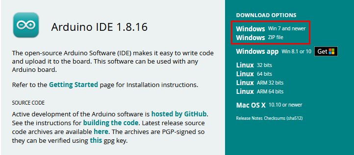
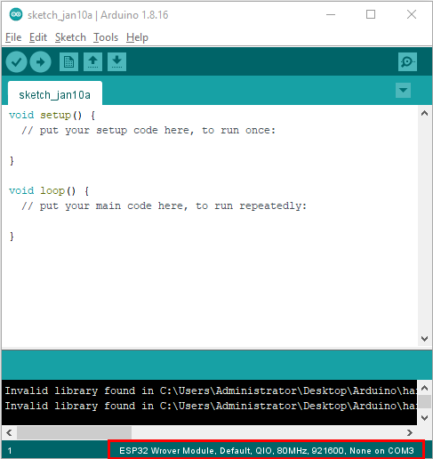
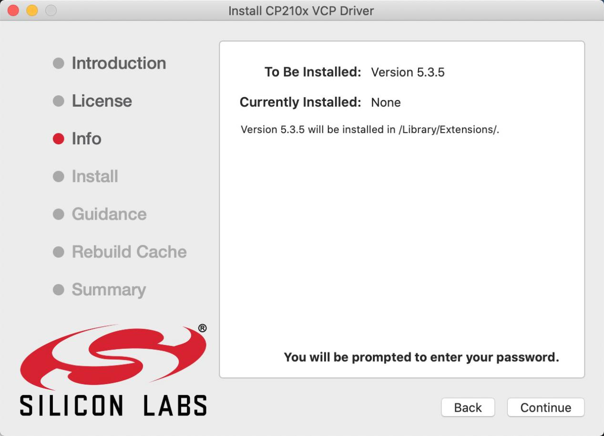
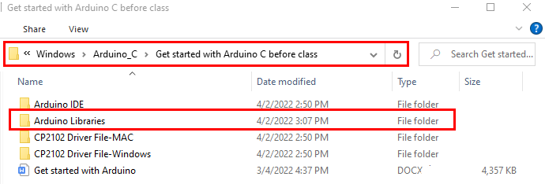
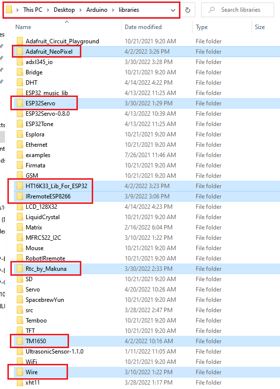

# Get started with Arduino C

**1. Windows System：**

**1.1 Installing Arduino IDE**

When you get control board, you need to download Arduino IDE and driver
firstly.

You could download Arduino IDE from the official website:

[https://www.arduino.cc/](https://www.arduino.cc/),
click the “SOFTWARE”on the browse bar, then
click“DOWNLOADS” to enter download page,
as shown below:

There are various versions of IDE for Arduino. Just download a version
compatible with your system. Here we will show you how to download and
install the windows version of Arduino IDE.

There are two versions of IDE for Windows system: Windows Win7 and newer
and Windows ZIP file. The former needs to install manually, while the
latter can be directly downloaded, without the need of installing it
manually.

You just need to click JUST DOWNLOAD.

After the Arduino is downloaded, click“I Agree”to continue installing
and click **Next.**

Then click **Install.**

If the following page appears, click **Install.**

## 1.2 Install a driver on Windows：

If you have installed the driver, just skip it.

Before using the ESP32 board, you must install a driver, otherwise it
will not communicate with computer.

Unlike the USB series chip (ATMEGA8U2) of the Arduino UNO R3, the ESP32
board uses the CP2102 chip USB series chip and USB type C interface.

The driver of the CP2102 chip is included in 1.8.0 version and newer
version of Arduino IDE. Usually, you connect the board to the computer
and wait for Windows to begin its driver installation process. After a
few moments, the process will succeed.

If the driver installation process fail, you need to install the driver
manually.

**Note:**

1\. Please make sure that your IDE is updated to 1.8.0 or newer version.

2\. If the version of Arduino IDE you download is below 1.8, you should
download the driver of CP2102 and install it manually.

Link to download the driver of CP2102:

[**https://fs.keyestudio.com/CP2102-WIN**](https://fs.keyestudio.com/CP2102-WIN)

To install the drive manually, open the device manager of computer.

Right click Computer----- Click Properties-----Click Device Manager.

Look under Ports (COM & LPT) or other devices.

A yellow exclamation mark means that the CP2102 driver installation
failed.

Double-click  and click “ **Update drive...**”

Click“Browse my computer for drivers ” to find installed or downloaded
Arduino software .  

There is a DRIVERS folder in Arduino software installed
package（）, open driver folder and you can see
the driver of CP210X series chips.

Click“Browse”to select the driver of CP210X series chips then
click“Next”.

Open device manager, you will find the yellow exclamation mark
disappear. The driver of CP2102 is installed successfully.

## 1.3. Install the ESP32 on Arduino IDE：

Note：you need to download Arduino IDE 1.8.5 or advanced version to
install the ESP32.

1)   Clickto open Arduino IDE
    
    

2)  Click **“ File**” →**“Preferences”**，copy the website address
    <https://dl.espressif.com/dl/package_esp32_index.json> in
    the“**Additional Boards Manager URLs:**”and click“**OK**”
    
    

3)  Click“**Tools**”→“**Board:**”then click “**Boards Manager...**”to
    enter“**Boards Manager**”. Enter **ESP32**”as follows, then click
    **Install .**
    
    
    
    
    
    (4) After installing, click“Close”

## 1.4. Arduino IDE Setting

Clickicon to pen Arduino IDE.

When downloading the sketch to the board, you must select the correct
name of Arduino board that matches the board connected to your computer.
As shown below;

(Note: we use the ESP32 board in this tutorial; therefore, we select
ESP32**)**

Set the board type as follows;

Then select the correct COM port (you can see the corresponding COM port
after the driver is successfully installed).

A- Used to verify whether there is any compiling mistakes or not.

B- Used to upload the sketch to your Arduino board.

C- Used to create shortcut window of a new sketch.

D- Used to directly open an example sketch.

E- Used to save the sketch.

F- Used to send the serial data received from board to the serial
monitor.

2.  **Mac System**

**2.1 Download Arduino IDE:**

## 2.2 How to install the CP2102 driver：

If you have installed the driver, just skip it.

Connect the ESP32 board to your computer, and open Arduino IDE

Click **Tools→Board:ESP32 Dev Module and /dev/cu.usbserial-0001.**

Click  to upload code.

Note: If code is uploaded unsuccessfully, you need to install the driver
of CP2102, please continue to follow the instructions as below:

Download the driver of CP2102:

<https://www.silabs.com/products/development-tools/software/usb-to-uart-bridge-vcp-drivers>

Select Mac OSX edition, as shown below;

Unzip the downloaded package.

Open folder and double-click **SiLabsUSBDriverDisk.dmg** file.

You will view the following files as follows:

Double-click “Install CP210x VCP Driver”, tick D**on’t warn me when
opening application on this** **disk image** and tap “ **Open”.**

Click“**Continue**”

Tap **Agree,** and **Continue**

Click **Continue** and input your password.

**Select** “**Select Open Security Preferences**”.

Click the lock to unlock security & privacy preference.

Tap **Unlock and** enter **your Username and password，**then click
**Allow.**

Back to installation page, and wait to install.

Successfully installed

Then enter ArduinoIDE, click **Tools** and select Board **ESP32 Dev
Module** and the serial port is“**/dev/cu.SLAB\_USBtoUAPT.**

Click to upload code and show“Done uploading”.

3.  **How to Add Libraries?**

**(1) What are Libraries ?**

[Libraries ](https://www.arduino.cc/en/Reference/Libraries)are a
collection of code that make it easy for you to connect sensors,
displays, modules, etc.

For example, the built-in LiquidCrystal library helps talk to LCD
displays. There are hundreds of additional libraries available on the
Internet for download.

The built-in libraries and some of these additional libraries are listed
in the reference. (https://www.arduino.cc/en/Reference/Libraries)

**(2) How to Install a Library ?**

Here we will introduce the most simple way to add libraries .

**Step 1:** After downloading well the Arduino IDE, you can right-click
the icon of Arduino IDE to find the option "Open file location" .

**Step 2:** Click **Open file location** \>libraries

**Step 3:** Next, find out the“libraries”folder

Copy in the libraries folder of Arduino.

Then click“Replace the files in the destination”.

