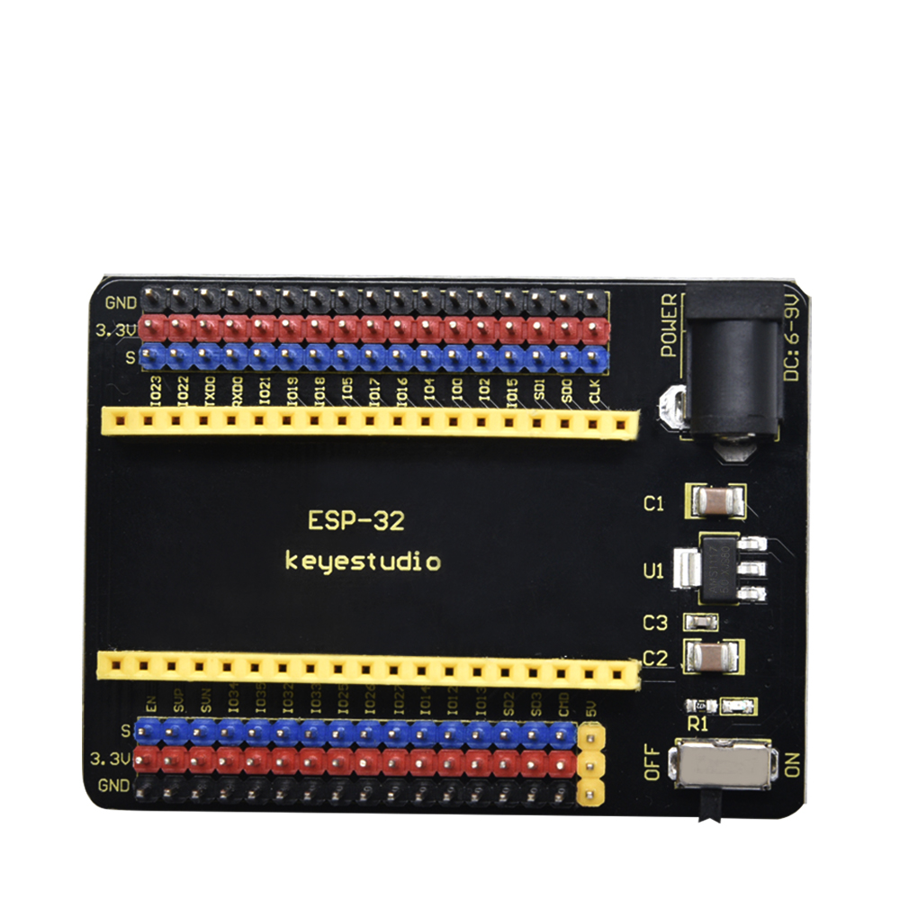
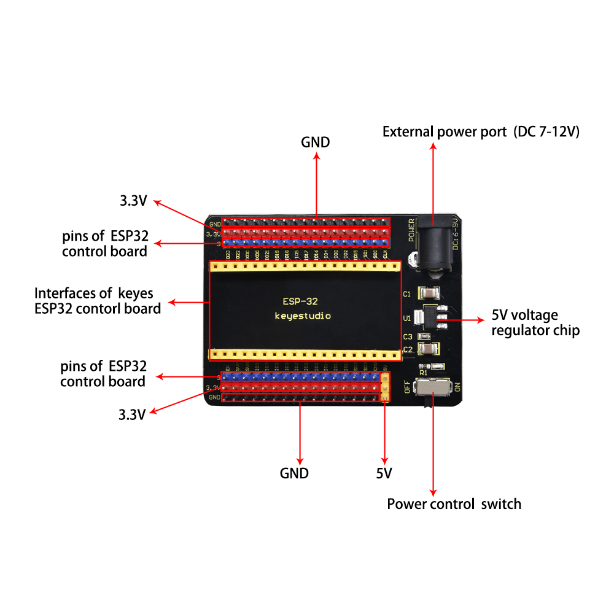

# **keyestudio ESP32 Core board** 

## Introduction

Keyestudio ESP32 Core board is a Mini development board based on the
ESP-WROOM-32 module. The board has brought out most I/O ports to pin
headers of 2.54mm pitch. These provide an easy way of connecting
peripherals according to your own needs.

When it comes to developing and debugging with the development board,
the both side standard pin headers can make your operation more simple
and handy.

The ESP-WROOM-32 module is the industry's leading integrated WiFi +
Bluetooth solution with less than 10 external components. It integrates
antenna switches, RF balun, power amplifiers, low noise amplifiers,
filters as well as power management modules. At the same time, it also
integrates TSMC's low-power 40nm technology, power performance and rf
performance, making it safe, reliable and easy to expand to a variety of
applications.  

## Specifications

Microcontroller: ESP-WROOM-32Module

USB to Serial Port Chip: CP2102-GMR

Working Voltage: DC 5V

Working
Current：80mA（[Average](C:/Users/NINGMEI/AppData/Local/youdao/dict/Application/8.10.7.0/resultui/html/index.html#/javascript:;)）

Current
Supply：500mA（[Minimum](C:/Users/NINGMEI/AppData/Local/youdao/dict/Application/8.10.7.0/resultui/html/index.html#/javascript:;)）

Working Temperature Range : -40°C \~ +85°C

WiFi Mode：Station/SoftAP/SoftAP+Station/P2P

WiFi
[Protocol](C:/Users/NINGMEI/AppData/Local/youdao/dict/Application/8.10.7.0/resultui/html/index.html#/javascript:;) ：802.11
b/g/n/e/i（802.11n，speed up to 150 Mbps

WiFi Frequency Range：2.4 GHz \~ 2.5 GHz

[Bluetooth](C:/Users/NINGMEI/AppData/Local/youdao/dict/Application/8.10.7.0/resultui/html/index.html#/javascript:;) [Protocol](C:/Users/NINGMEI/AppData/Local/youdao/dict/Application/8.10.7.0/resultui/html/index.html#/javascript:;) ：conform
to Bluetooth v4.2 BR/EDR and BLE standard

Dimensions：55\*26\*13mm

Weight：9.3g

## Pin out

ESP32 has fewer pins than commonly used processors, but it doesn't have
any problems reusing multiple functions on pins.    
Warning: The pin voltage level of the ESP32 is 3.3V.  If you want to
connect the ESP32 to another device with an operating voltage of 5V, you
should use a level converter to convert the voltage level.  

**●Power Pins:** The module has two power pins +5V and 3.3V, which can
be used to power other devices and modules. 

**● GND Pins：**The module has three grounded pins.  
**● Enable pin (EN) :** This pin is used to enable and disable modules.
The pin enables module at high level and disables module at low level.  

**● Input/Output pins (GPIO) :** You can use 32 GPIO pins to communicate
with LEDs, switches and other input/output devices. You can also pull
these pins up or down internally.  

**Note:** GPIO6 to GPIO11 pins (SCK/CLK, SDO/SD0, SDI/SD1, SHD/SD2,
SWP/SD3 and SCS/CMD pins) are used for SPI communication for the
internal module, which are not recommended.    
● ADC: You can use the 16 ADC pins on this module to convert analog
voltages (the output of some sensors) into digital voltages. Some of
these converters are connected to internal amplifiers and are capable of
measuring small voltages with high accuracy.

 **● DAC:** ESP32 module has two A/D converters with 8-bit precision.  
**● Touch pad:** The ESP32 module has 10 pins that are sensitive to
capacitance changes. You can attach these pins to certain pads (pads on
a PCB) and use them as touch switches. **   
● SPI:** There are two SPI interfaces on the module, which can be used
to connect the display screen, SD/microSD memory card module as well as
external flash memory, etc. **   
● I2C:** SDA and SCL pins are used for I2C communication.    
**● Serial Communication (UART) :** There are two UART serial interfaces
on this module, which can be used to transfer up to 5Mbps of information
between two devices. The UART0 also has CTS and RTS control functions. 

**●PWM:** Almost all ESP32 input/output pins can be used for PWM
(pulse-width modulation). Using these pins can control the motors, LED
lights and colors, etc.  

4.  **Components**
    
    

**Keyestudio ESP32-IO Expansion Board**

1.  **Overview**

Keyestudio ESP32-IO Expansion Board is designed to be compatible with
the Keyestudio ESP32 Core Board (KS0413), which leads all pin
connections of the ESP32 Core Board using a row of pins spaced 2.54mm
apart. To facilitate the connection of other sensors, it also has two
rows of pins with a spacing of 2.54mm rows, which are used to supply
3.3V DC power for external sensors/modules. 

A power supply circuit is designed on the control board as it seeks to
power the Keyestudio ESP32 Core Board easily. You solely need to input
DC 6-9V voltage on the black DC head to power it. In addition, it also
has a DIP switch to control the power switch.  

2.  **Specifications**
    
    [Voltage](C:/Users/NINGMEI/AppData/Local/youdao/dict/Application/8.10.7.0/resultui/html/index.html#/javascript:;)
    [Supply](C:/Users/NINGMEI/AppData/Local/youdao/dict/Application/8.10.7.0/resultui/html/index.html#/javascript:;) ：DC
    6-9V
    
    Operating Current：60mA
    
    Maximum Power：0.3W
    
    Working Temperature：-25℃ to +65℃
    
    Dimensions：30mm\*20mm
    
    Environmental Protection Attributes：ROHS

3.  **Pins and Components**

